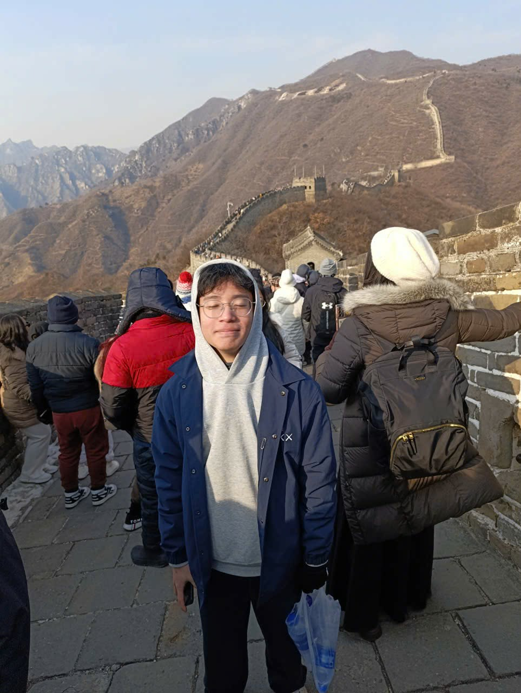

# WRO_2026_Future_Engineers
# Hello! We are **Team Fast 5**.

# WRO Future Engineers - Robotics Project Documentation

## Our Team 


Fast 5 is a team of two students from Kid Engineer Organization, also known as Thay Phong STEM, competing in the WRO Future Engineers category. This repository documents our full engineering process for design, components, testing, and code for our self-driving car. 

## Team Members
| Photo | Member | Role |
|---|---|---|
|  | **Luu Duc Trung** |  Lead mechanical builder - brings prior WRO experience (WRO 2024, 2025) and designed/assembled the robot |
|  | **Truong Dinh Bach** |  Responsible for documenting the team's development process and photography |

<a name="top"></a>

## Table of Contents
- [1. Overview](#1-overview)
  - [1.1 About the Project](#11-about-the-project)
  - [1.2 Robot Images](#12-robot-images)
  - [1.3 Performance Video](#13-performance-video)
- [2. Mobility Management](#2-mobility-management)
  - [2.1 Drive System](#21-drive-system)
  - [2.2 Steering](#22-steering)
  - [2.3 Chassis Design](#23-chassis-design)
- [3. Power and Sense Management](#3-power-and-sense-management)
  - [3.1 Power Source](#31-power-source)
  - [3.2 Sensors and Camera](#32-sensors-and-camera)
  - [3.3 Processing Units](#33-processing-units)
  - [3.4 Port / Wiring Map](#34-port--wiring-map)
  - [3.5 Power Consumption](#35-power-consumption)
- [4. Obstacle Management](#4-obstacle-management)
  - [4.1 Open Challenge](#41-open-challenge)
  - [4.2 Obstacle Challenge](#42-obstacle-challenge)
  - [4.3 Parallel Parking](#43-parallel-parking)
- [5. Source Code](#5-source-code)
  - [5.1 Code Overview](#51-code-overview)
  - [5.2 Code Structure](#52-code-structure)
  - [5.3 Upload / Run Instructions](#53-upload--run-instructions)
- [6. List of Components](#6-list-of-components)
- [7. 3D Model Files](#7-3d-model-files)
- [8. Building Instructions](#8-building-instructions)

> **Note on sections 7 and 8:** these are laid out with the same structure the team will use once full CAD/photo detail is ready — send the model files and assembly photos and they'll be completed.

---

## 1. Overview

### 1.1 About the Project

This project is our self-driving car for the WRO Future Engineers category: an autonomous vehicle that completes the **Open Challenge** (three laps of an unknown, randomised track without touching a wall) and the **Obstacle Challenge** (three laps while reading and reacting to red/green traffic signs, followed by parallel parking).

This is the first year our team has competed in this category, so a large part of this project has been building up new engineering and programming experience from scratch - much of it inherited from Trung's two prior seasons in the Robo Sports 

Our robot is built on a **custom LEGO Technic + 3D-printed (PLA) chassis**, in a **rear-wheel differential-drive, Ackermann front-steer** configuration, controlled by a **LEGO® Education SPIKE™ Prime Hub** and a **Matrix Robotics M-Vision Cam** for onboard image processing. Design priorities, in order, were: a low center of gravity for stability, a lightweight structure to reduce motor strain, and a minimal footprint for maneuverability.

The current build is our **second full revision (v2)** — see §2.3 for what changed from v1 and why.

### 1.2 Robot Images

<table>
  <tr>
    <td align="center"><b>Front View</b><br></td>
    <td align="center"><b>Left View</b><br></td>
    <td align="center"><b>Right View</b><br></td>
  </tr>
  <tr>
    <td align="center"><b>Back View</b><br></td>
    <td align="center"><b>Top View</b><br></td>
    <td align="center"><b>Bottom View</b><br></td>
  </tr>
</table>

### 1.3 Performance Video

[Open Challenge run](https://youtu.be/gR-lhKKfd4c)

[Obstacle Challenge run]()

<p align="right"><a href="#top">Back To Top</a></p>

---

## 2. Mobility Management

- **Drive system:** rear-wheel differential drive.
- **Steering:** front-wheel Ackermann steering.

### 2.1 Drive System

**Motor: LEGO® Technic™ Large Angular Motor** (drives the rear differential)

<table>
  <tr>
    <td align="center" width="260"></td>
    <td>
      <h4>Specifications</h4>
      <ul>
        <li>Connector: LEGO® Power Functions 2.0 (LPF2)</li>
        <li>Voltage range: 5–9V (SPIKE Hub nominal: 7.2V)</li>
        <li>No-load speed: ~175 RPM (team measurement, vs ~135 RPM for the stock SPIKE-branded Large Angular Motor)</li>
        <li>Feedback: integrated rotation/position sensor</li>
      </ul>
    </td>
  </tr>
</table>

**Reason for Selection**
- Higher RPM than the stock SPIKE motor, for faster lap times on the flat competition arena.
- Smaller footprint with more mounting-hole positions on the case, giving flexibility in where it sits on the chassis.
- Built-in rotation sensor gives closed-loop feedback for encoder-based distance/angle control (see `Enc_cal`, `MotorB_degree` in §5).

**Differential Gear**

A LEGO differential sits between the two rear wheels, letting them spin at different speeds through a turn — the inner wheel travels a smaller-radius arc than the outer wheel, so without a differential one wheel would have to scrub/slip. This keeps cornering smooth and reduces wheel wear and drift, particularly during tight turns in the Obstacle Challenge and during parking.

**Wheels: 62.3 mm Technic tires (rear)**

Wide, large-diameter tires were chosen for the rear (driven) wheels to maximize grip and acceleration off the line and out of turns.

**Considerations**

The Large Motor's torque is adequate for the flat competition surface but is a limiting factor for future speed increases — a heavier gear-down or a higher-torque motor is a candidate upgrade if we push for faster lap times.

### 2.2 Steering

**Motor: LEGO® Technic™ Large Angular Motor + 1:1 gearbox**

<table>
  <tr>
    <td align="center" width="260"></td>
    <td>
      <h4>Specifications</h4>
      <ul>
        <li>Connector: LPF2</li>
        <li>Voltage range: 5–9V</li>
        <li>Stall torque: ~40 N·cm with the 1:1 gearbox (team measurement, vs ~25 N·cm for the stock SPIKE Angular Motor)</li>
        <li>Feedback: integrated rotation/position sensor, used for heading/angle-based turns (`MotorB_Angle`)</li>
      </ul>
    </td>
  </tr>
</table>

**Reason for Selection**
- Highest available stall torque among LEGO Powered Up motors, needed to move the Ackermann linkage under load.
- Position feedback lets steering angle be driven and held precisely rather than open-loop.

**Steering geometry: Ackermann steering**

We use Ackermann geometry so the two front wheels turn at different angles in a corner - the inner wheel (tracing the smaller-radius arc) turns more sharply than the outer wheel - letting both wheels roll without slipping. This is the same principle full-scale cars use for efficient, accurate turning, and it matters for us in tight obstacle-avoidance maneuvers and parking, where precision beats raw turning speed.


**Wheels: 49.5 mm SPIKE wheels (front)**

Small diameter for agility and quick direction changes at the steered wheels.

**Considerations**

Even with the 1:1 gearbox, torque at the steering linkage was tighter than expected after the first v2 build - a candidate area to revisit (e.g. a different gear ratio or linkage geometry) if we find the robot under-steering at speed.

### 2.3 Chassis Design

**Design Overview**

The chassis is built from **LEGO Technic**, supplemented with **custom 3D-printed PLA parts** wherever no suitable LEGO piece exists - most notably the Ultrasonic sensor Adapter. LEGO was our starting material because the team (particularly Trung) has multiple prior seasons of hands-on build experience with it; 3D printing filled the remaining gaps and gave us full freedom over part geometry.

**v1 → v2 changes**

| Change | Reason |
|---|---|
| Elevated, forward-mounted camera → lower, front-mounted camera | Removed scaffolding weight/instability while keeping an adequate field of view |
| Longer chassis → shorter chassis | Lower, more centralized mass → better stability in sharp turns, less drift |
| SPIKE wheel (rear) → 62.3 mm LEGO wheel (rear) | More rear-wheel friction on the driving surface |

<p align="right"><a href="#top">Back To Top</a></p>

---

## 3. Power and Sense Management

### 3.1 Power Source

**Battery: SPIKE Prime rechargeable Li-ion Hub Battery**

<table>
  <tr>
    <td>
      <h4>Specifications</h4>
      <ul>
        <li>Type: rechargeable lithium-ion, charged in-hub via micro-USB</li>
        <li>Capacity: ~2,000–2,100 mAh (per LEGO Education spare-part listings)</li>
        <li>Working range used in our firmware: 6,900–8,300 mV (see <code>Battery()</code> in §5), consistent with a 2-cell Li-ion pack</li>
      </ul>
    </td>
  </tr>
</table>

The battery powers the SPIKE Prime Hub directly; the Hub in turn supplies all motors and sensors over their LPF2 leads, and the M-Vision Cam over its dedicated 5V cable - no separate step-up/step-down conversion is needed anywhere in the system, since the camera's 5V input matches the Hub's output.

Our firmware reads `hub.battery.voltage()`, clamps it to the 6,900–8,300 mV working range, and converts it to a 0–100% estimate so we can catch a low-charge robot before a run.

**Considerations**

Because everything runs off one Hub battery with no separate motor supply, our power architecture is much simpler than a Raspberry Pi-class system (no MOSFET power-switching, no DC-DC boost converter, no separate motor driver IC) - the tradeoff is that we're bound to whatever voltage/current the Hub itself can deliver.

### 3.2 Sensors and Camera

**Camera: Matrix Robotics M-Vision Cam (Type-C cable pack)**

<table>
  <tr>
    <td>
      <h4>Specifications</h4>
      <ul>
        <li>Processor: STM32H7, 480 MHz</li>
        <li>Interface: UART over LPF2 to the SPIKE Prime Hub</li>
        <li>Operating voltage: 5V (matches Hub output directly)</li>
        <li>Color space: LAB (in addition to RGB/HSV)</li>
      </ul>
    </td>
  </tr>
</table>

**Reason for Selection**
- Has its own onboard processor, so the Hub doesn't have to run image-processing algorithms itself - this saves battery and keeps the Hub's CPU free for motor/sensor control.
- Supports **LAB color space**, which separates brightness (L) from color (A/B). Since the A/B axes stay comparatively stable when the arena's lighting shifts brighter or darker, LAB gives more consistent line/color detection than RGB or HSV under variable lighting.

**Tasks:** line following and wall-fill detection (Open Challenge); red/green traffic-sign blob detection, magenta parking-wall detection, and lap-boundary color detection (Obstacle Challenge).

**Distance sensing: 2× LEGO® Technic™ Distance Sensor (ultrasonic)**

<table>
  <tr>
    <td>
      <h4>Specifications (manufacturer)</h4>
      <ul>
        <li>Sensing technology: ultrasonic</li>
        <li>Range: 50–2,000 mm (fast-sensing mode: 50–300 mm)</li>
        <li>Accuracy: ±1 cm</li>
        <li>Extras: 4-segment programmable LED "eyes"; detachable LPF2 breakout on the rear</li>
      </ul>
    </td>
  </tr>
</table>

**Tasks:** one sensor on each side reads distance to the left/right walls. At the start of a run, this tells the robot whether the course is Clockwise or Counterclockwise (by checking which side has a wall); during a run, it feeds `Ultra_err()`/`Ultra_steer()` to hold a consistent stand-off from the wall and correct heading error.

**Ground sensing: LEGO® Technic™ Color Sensor**

<table>
  <tr>
    <td>
      <h4>Specifications (manufacturer)</h4>
      <ul>
        <li>Detects 8 discrete colors, plus RGB/HSV values</li>
        <li>Measures reflected light intensity (for line-following) and ambient light</li>
        <li>High sample rate for consistent, repeatable readings</li>
      </ul>
    </td>
  </tr>
</table>

**Tasks:** reads ground color for lap-boundary/start-line detection, feeding `Color_read()` and `Color_line_count()` for lap counting.

### 3.3 Processing Units

**Controller: LEGO® Education SPIKE™ Prime Hub**

| | Mindstorms EV3 | SPIKE Prime |
|---|---|---|
| CPU Clock Speed | 300 MHz | 100 MHz |
| Weight (incl. battery) | 385 g | ~200 g |
| Volume | 0.388 L | 0.158 L |

**Reason for Selection**

We chose SPIKE Prime over EV3 even though its CPU clock speed is lower, because it's roughly half the weight and less than half the volume of the EV3 Hub — both of which matter more for our low-CG, lightweight design goals than raw clock speed, given that the M-Vision Cam (not the Hub) does the heavy image-processing work.

### 3.4 Port / Wiring Map

Everything connects to the Hub over standard LEGO LPF2 cables — no custom wiring harness or PCB is needed. Current assignments (from `FE_Functions.py`):

| Hub Port | Device | Role |
|---|---|---|
| A | Matrix M-Vision Cam | Line / wall / traffic-sign detection |
| B | Technic Large Motor | Drive (rear differential) |
| C | Technic XL Motor | Steering (Ackermann linkage) |
| D | Distance Sensor (right) | Right-wall distance |
| E | Color Sensor | Ground color / lap detection |
| F | Distance Sensor (left) | Left-wall distance |

### 3.5 Power Consumption

All components are powered from the SPIKE Prime Hub's own 7.3 V Li-Ion battery.

| Component | Voltage | Current (typical) | Current (peak) | Power (typical) |
|---|---|---|---|---|
| SPIKE Prime Hub | 7.2 V | 1.0 A | 1.5 A | 7.2 W |
| M-Vision Camera | 5 V (Type-C) | 0.15 A | 0.3 A | 0.75 W |
| Ultrasonic ×2 | 5 V (from hub) | 0.04 A | 0.06 A | 0.2 W |
| Drive motors ×2 | 7.2 V | 1.0 A | 2.0 A | 7.2 W |
| **Total** | | **2.19 A** | **3.86 A** | **15.35 W** |

<p align="right"><a href="#top">Back To Top</a></p>

---

## 4. Obstacle Management

The competition has two runs:
- **Open Challenge:** three laps around a randomly-sized field, in a randomly-chosen direction, without touching a wall.
- **Obstacle Challenge:** three laps while reading traffic signs - pass a red sign on its right, a green sign on its left - then parallel-park in a marked bay.

We split our strategy into the same three phases:

### 4.1 Open Challenge

Two boxes are drawn on the left and right of the camera frame. Pixels within a tuned RGB threshold count as "black," and the robot centers itself on the track by comparing the black-fill ratio of the two boxes, correcting with **PID** steering. A box at the center of the frame watches for the orange/blue start-line color; whichever color it sees first tells the robot whether the course is Clockwise or Counterclockwise. Two small boxes at the bottom of the frame catch the case where the robot gets close enough to a wall that the main boxes lose the line, switching to a "priority correction" mode driven by those bottom boxes instead - this stops the robot from hugging the wall or losing track when the front sensors go unreliable. A tunable default wall-hugging offset (e.g. +30°) keeps the robot tracking tightly and minimizes lap time.

<details>
<summary><b>Click here to show Open Challenge code excerpt</b></summary>

```python
Add = 200 if Cam_val[0]>10 and Cam_val[1]>10 else 0
while GetColor() == 0:
    steering(0)
Drive.reset_angle(0)
while abs(Drive.angle()) < Add:
    steering(0)

if GetColor() == 1:
    ColorCondition = 1
    Plus = -30
else:
    ColorCondition = -1
    Plus = 40

for i in range(11):
    while GetColor() != ColorCondition:
        SteerCamOpen(ColorCondition, Plus)
    while GetColor() == ColorCondition:
        SteerCamOpen(ColorCondition, Plus)
Drive.reset_angle(0)
while abs(Drive.angle()) < 2000:
    SteerCamOpen(ColorCondition, Plus)
```

</details>

### 4.2 Obstacle Challenge

**Block detection:** the camera looks for pixel regions matching pre-tuned thresholds for black, red, green, and magenta. Adjacent matching pixels are grouped into a bounding-box "blob"; a minimum-area threshold filters out noise, and a density check (`b.density()`) discards blobs where the matched color isn't dense enough to be a real sign.

**When a sign is visible:** a **PD controller** steers the robot to line up directly with the red/green blob. Distance is estimated from the blob's pixel width in-frame:
- Width > 60 px → sign is close → begin the fixed avoidance maneuver.
- Width > 90 px → sign is very close → back up a few centimeters first, then execute the maneuver.

**Once all signs are passed:** a box on the left of the frame targets 70% black fill against the wall; the *difference* from that 70% target drives a **PID** correction so the robot tracks close and parallel to the wall. A center box watches for the blue boundary line to trigger the next turn, timed to leave room for course correction before the next sign. Because magenta parking-lot walls can wash out the black wall-detection box, magenta pixels are also counted toward the "wall" rectangle so the robot doesn't cut into the parking lot.

### 4.3 Parallel Parking

After completing 3 laps, the robot aligns to the wall using the same wall-following method as above, then drives until the magenta parking-lot color crosses a specific X-coordinate in the camera frame. From that trigger point, a **pre-programmed, encoder-based maneuver sequence** completes the park - deliberately not a fully vision-guided park, since the travel distance involved is short enough that encoder error stays within an acceptable margin, and it avoids depending on vision precision we haven't yet fully validated for this sub-task.

<p align="right"><a href="#top">Back To Top</a></p>

---

## 5. Source Code

### 5.1 Code Overview

- **Language/runtime:** Pybricks (MicroPython) on the SPIKE Prime Hub.
- **Vision:** OpenMV IDE on the M-Vision Cam, using the `LPF2` import so it can talk to the Hub.
- **Custom libraries:** `MXLineT_Lib` (camera/line-tracker interface).

### 5.2 Code Structure

```txt
repo-root
└─ src
   ├─ Camera
   │  ├─ LPF2.py            # External library (depends on libcamera)
   │  ├─ main.py
   ├─ Controller       
   │  ├─ FE_Functions.py 
   │  ├─ FE_Portview.py               
   │  ├─ FE_RUN.py          # Executable for both open and obstacle challenges         
```

**Key function groups in `FE_Functions.py`:**

| Group | Functions | Role |
|---|---|---|
| Utility | `NumberLimit_Clamp`, `Enc_cal` | Clamp a value to a safe range; convert cm → motor degrees |
| Power | `Battery()` | Reads Hub voltage, clamps 6,900–8,300 mV, returns battery % |
| Color / laps | `Color_read()`, `Color_line_count()` | Classify raw RGB as a line color; count line crossings for laps |
| Wall following | `Ultra_err()`, `Ultra_steer()` | Compute steering correction from the two distance sensors |
| Drive control | `MotorB_On/Stop/Time/Degs/degree/smooth/3step/dist/...` | Run the drive motor by power, time, angle, or distance, incl. smoothed accel/decel and 3-stage speed profiles |
| Heading control | `MotorB_Angle`, `Theta()`, `Compass()`, `ReTheta()` | Gyro (IMU)-based heading hold / turn-to-angle |

> **Known issue to fix:** `Ultra_steer()` currently has a syntax gap — `90*Line_count // 2 Line_count % 2 * 45 ...` is missing an operator between `//2` and `Line_count`. Worth patching before this is treated as "final" competition code.

### 5.3 Upload / Run Instructions

1. Install the [Pybricks firmware](https://code.pybricks.com) onto the SPIKE Prime Hub (one-time step, via the Pybricks web IDE over USB or Bluetooth).
2. Connect to the Hub from the Pybricks IDE (or VS Code with the Pybricks extension) and open `FE_Functions.py` plus the relevant challenge script.
3. Flash/run the program on the Hub.
4. Separately, open the corresponding vision script in **OpenMV IDE**, connect to the M-Vision Cam over its Type-C cable, and run/save it to the camera so it starts automatically on power-up.
5. Power on the robot - Hub and camera boot together once battery power is applied.

<p align="right"><a href="#top">Back To Top</a></p>

---

## 6. List of Components

| Component | Quantity | Source / Reference |
|---|---|---|
| LEGO® Education SPIKE™ Prime Hub | 1 | LEGO Education |
| SPIKE Prime rechargeable Hub battery | 1 | [LEGO Education 45610](https://education.lego.com/en-us/products/lego-technic-large-hub-battery/45610/) |
| Technic™ Powered Up Large Motor (drive + steering) | 2 | [LEGO 88013](https://education.lego.com/en-us/products/lego-technic-large-angular-motor/45602/) |
| LEGO differential gear | 1 | LEGO Technic |
| 62.3 mm Technic tires (rear) | 2 | LEGO Technic |
| 49.5 mm SPIKE wheels (front) | 2 | LEGO SPIKE Prime |
| Matrix Robotics M-Vision Cam + Type-C cable pack | 1 | Matrix Robotics |
| LEGO® Technic™ Distance Sensor (ultrasonic) | 2 | [LEGO Education 45604](https://education.lego.com/en-us/products/lego-technic-distance-sensor/45604/) |
| LEGO® Technic™ Color Sensor | 1 | [LEGO Education 45605](https://education.lego.com/en-us/products/lego-technic-color-sensor/45605/) |
| Custom 3D-printed PLA parts (mounts, brackets) | Various | 3D-printed in-house |
| LEGO Technic structural elements | Various | LEGO Technic |

*(Quantities/sources for fasteners, printer filament brand, and any remaining hardware can be added once the full BOM is finalized.)*

<p align="right"><a href="#top">Back To Top</a></p>

---

## 7. 3D Model Files (SLDPRT)

We used SLDPRT to design the 3D models to finish the robot.

- [**Ultrasonic sensor adapter**](Ultra_adapter.SLDPRT) 
- [**Cam Holder**](cam_holder.SLDPRT)


<p align="right"><a href="#top">Back To Top</a></p>

---

## 8. Building Instructions

**Status: placeholder — to be completed.**

Planned outline, ready to fill in with photos once available:

**Step 0 — Print the 3D parts:** print all custom PLA parts listed in §7.2, using the settings from §7.3.

**Step 1 — Assemble the steering system:** front wheel linkages → Ackermann/reverse-Ackermann linkage → mount to chassis → attach XL steering motor → secure front wheels.

**Step 2 — Assemble the drivetrain:** rear wheel axles → differential → Large drive motor → secure to chassis → attach rear wheels.

**Step 3 — Mount electronics:** SPIKE Prime Hub placement → M-Vision Cam mounting/aiming → Distance Sensors (left/right) → Color Sensor → route and connect all LPF2 cables per the port map in §3.4.

**Step 4 — Upload the software:** follow §5.3 to flash the Hub and camera, then power on and test.

Send build photos or notes, and this will be turned into a numbered, judge-readable guide with images at each step.

<p align="right"><a href="#top">Back To Top</a></p>

---

*Sources: team README, robot configuration notes, `FE_Functions.py`, and official LEGO Education / LEGO.com technical specification pages linked above.*